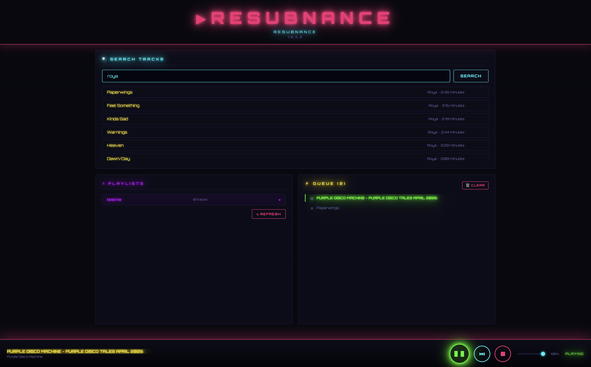

# Resubnance

Resubnance is a standalone audio player that streams directly from a Subsonic-compatible server (such as [Navidrome](https://www.navidrome.org/)); controlled by a web interface. 



## Pre-1.0 Notes

While I use the system daily, this is still under development. It may crash occasionally or require a restart to become unstuck 😅

## Features

- **Playback**: so far, ALSA is supported (and tested)
- **SubSonic API streaming**: streams directly from your server 
- **Disk-Cache**: optionally store data on disk while playing
- **Web UI**: access the player (and cache management) from outside the machine
- **API access**: create your own client to control resubnance (a bot? TUI? physical buttons?)
- **Containerized**: as anything these days

### Roadmap

No guarantees 😃

- Better stability
- Better UX 
- PulseAudio support
- Radio mode
- Plugins

## (Suggested) Setup

Since there are many different audio setups out there, let me clarify the use case that spawned Resbunance. Let's start off with ...

... hardware:

 - Raspberry Pi
 - Optional: Sound card/HAT
 - Speaker, connected via cable
 - Navidrome, reachable from the Raspberry Pi
  
Attach the speaker to the sound card/HAT and that to the Raspberry Pi and run the Resubnance container there. Provide the credentials and configuration for reaching both the sound card and Navidrome. 

Once running, you should be able to access your Navidrome library using Resubnance's web UI search and play the songs on the speaker attached to the Raspberry Pi. 

That's it!

# Compose 

```
services:
  resubnance:
    build: .
    restart: always
    privileged: true # required for sound device access. use at your own risk 
    environment:
      - RUST_LOG=hyper=info,tokio_reactor=info,symphonia_core=info,rustls=info,h2=info,debug
      - TOKIO_WORKER_THREADS=3 # 3 or more for the best experience
    volumes:
      - ./config.toml:/resubnance/config.toml
      - ./asound.conf:/etc/asound.conf         # if required
      - resubnance-cache:/tmp/resubnance-cache # configure this in config.toml
    # Traefik setup, for your convenience
    # labels:
    #   - traefik.enable=true
    #   - traefik.http.routers.resubnance.entrypoints=https
    #   - traefik.http.routers.resubnance.rule=Host(`resubnance.mydomain.tld`)
    #   - traefik.http.routers.resubnance.tls.certresolver=letsencrypt
    #   - traefik.http.routers.resubnance.service=resubnance
    #   - traefik.http.services.resubnance.loadbalancer.server.port=3000
    # networks:
    #  proxy:

# networks:
#  proxy:
#    external: true

volumes:
  resubnance-cache:
```

## Example config

Find it [here](config.toml)

# Contributing

If you are using the software and encounter any issues, please open tickets here. Provide detailed information for us to diagnose the problem further, or better, fix it yourself. 

Vibe coded contributions won't be accepted. 

# License 

GPL 3.0